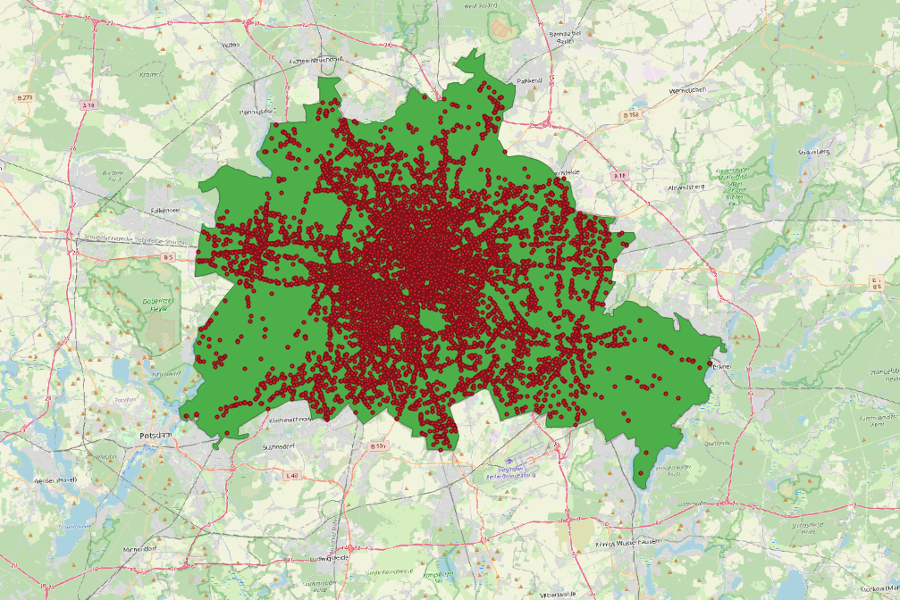
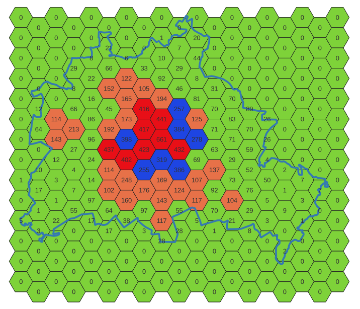
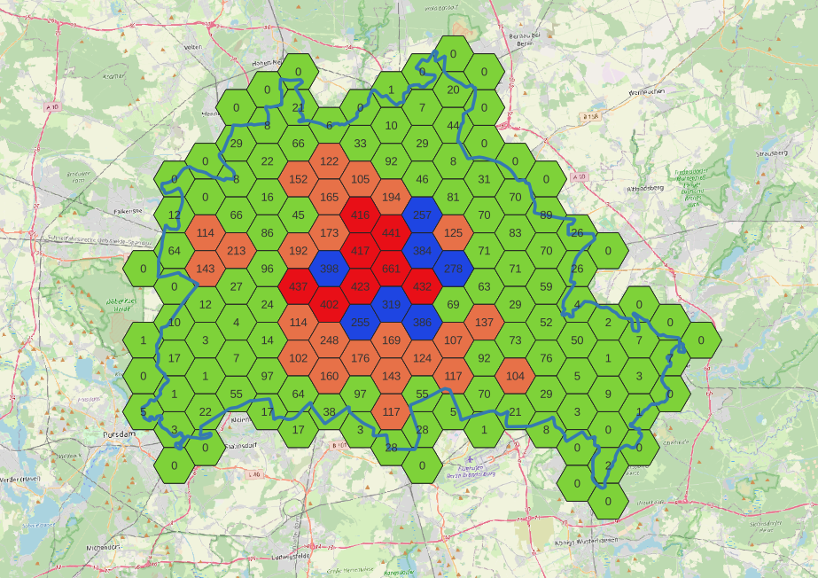

# Praxisbezogene geographische Datenanalyse: Visuelle Analyse der Unfallhäufigkeiten in Berlin 2022 nach Zonen

## 1. Erwerb von Open-Source-Daten
Die Daten zu Unfallorten für das Jahr 2022 in Deutschland im Shapefile-Format und die Berliner Stadtgrenzen im GeoJSON-Format wurden als Open Source / zur freien Nutzung erworben. Die Shapefile-Daten für ganz Deutschland befinden sich nicht im GitHub, da sie eine Datengröße von 1,2 GB haben.

## 2. Angleichung der Koordinatensysteme
Die erworbenen Daten (Unfallorte.shp) waren im UTM32-Koordinatensystem, während die Berliner Stadtgrenze im WGS84-Koordinatensystem vorlag. Um die Daten gemeinsam verarbeiten zu können, wurden die Stadtgrenzendaten in das UTM32-Koordinatensystem konvertiert. Dies wurde in QGIS durchgeführt, indem die Features im UTM32-Koordinatensystem exportiert wurden.

## 3. Import der Daten in eine PostgreSQL-Datenbank
Die räumlichen Daten können durch PostGIS in eine PostgreSQL-Datenbank importiert werden. Dafür ist eine Konvertierung vom Shapefile in SQL erforderlich.
```bash
shp2pgsql -s 25382 -I Unfallorte.shp public.Unfallorte | psql -U postgres -d accident_places
```
-s 25832 definiert Koordinatensystem nach EPSG Nummer von Input Daten

-d accident_places ist Datenbankname in PostgreSQL

Nach dem Import können nun alle Felder erreicht werden.
```sql
SELECT column_name, data_type
FROM information_schema.columns
WHERE table_name = 'accident_places';
```
Als Ergebnis dieses Prozesses befinden sich in der Datenbank 256.492 Punkte (Point-Features) mit 27 Feldern.

| column_name | data_type |
|----------|----------|
| objectid | double precision |
| ustunde | character varying |
| uwochentag | character varying |
| uwochentag | character varying |
...

## 4. Datenanalyze in QGIS
### 4.1. Clipping der Daten in Berlin
Mithilfe des Clip-Tools in QGIS wurden die Features innerhalb der Berliner Stadtgrenzen ausgeschnitten. Dieser Schritt resultierte in 12.336 Punkten, die Unfälle in Berlin repräsentieren.



## 4.2. Erstellung von Rastern auf dem Berliner Polygon und Zählung der Unfälle in jeder Zelle
Mit dem Tool zur Erstellung von Rastern können Raster auf dem Berliner Polygon erstellt werden. Das Tool "Count Points in Polygon" ermöglicht es uns, die Anzahl der Unfälle in jeder Zelle zu ermitteln.



## 5. Darstellung der Ergebnnissen
Das Feld "NUMBERPOINTS" zeigt, dass die Anzahl der Unfälle zwischen den Zellen zwischen 0 und 661 variiert. Mit dem Symbology-Tool und entsprechenden Abfragen können wir die Ergebnisse der durchgeführten Analyse deutlich visualisieren. Die Kategorisierung wird wie folgt vorgenommen:
* Grünzellen = 0-99 Unfälle
* Orangenzellen = 100-249 Unfälle
* Blauzellen = 250-399 Unfälle
* Rotzellen = 400 und mehr Unfälle



Wie erwartet weist das Stadtzentrum eine höhere Anzahl von Unfällen im Vergleich zu den Außenbezirken auf. Mit dieser einfachen Analyse können Unfallschwerpunkte definiert und für weitere Planungen genutzt werden.


